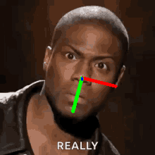
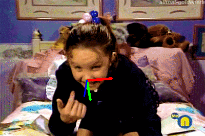

# Head Pose Estimation

### Introduction

Welcome to the head pose estimation project! This project aims to estimate the orientation of a person's head in an image by using classical machine learning models. The project is a part of a machine learning diploma program in Artificial Intelligence and Machine learning studied in Information Technology Institute.

### Requirments
* numpy
* os
* scipy
* math
* pandas
* mediapipe
* os
* sklearn
* glob
* warnings
* imageio
* urllib
* pathlib

### The Data

The input to the models is 468 facial landmarks extracted from the input image using the Mediapipe library in Python. The models were trained and evaluated on the AFLW2000-3D dataset, which contains 2000 images of human faces with their corresponding 3D head poses and 21 2D facial landmarks for each image.

### Model 

The trained models in this project include Support Vector Machines (SVMs), XGBoost Regressor, Ridge, and Lasso . The project also includes the script that was used to download and read the data, extract 2d-landmark points. also the training of the model and predicting on different images from internet.

### Results

